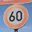
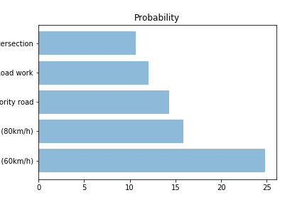

# **Traffic Sign Recognition** 

## Writeup

**Build a Traffic Sign Recognition Project**

The goals / steps of this project are the following:
* Load the data set (see below for links to the project data set)
* Explore, summarize and visualize the data set
* Design, train and test a model architecture
* Use the model to make predictions on new images
* Analyze the softmax probabilities of the new images
* Summarize the results with a written report

[//]: # (Image References)

[image1]: ./examples/visualization.jpg "Visualization"
[image2]: ./examples/grayscale.jpg "Grayscaling"
[image3]: ./examples/random_noise.jpg "Random Noise"
[image4]: ./examples/placeholder.png "Traffic Sign 1"
[image5]: ./examples/placeholder.png "Traffic Sign 2"
[image6]: ./examples/placeholder.png "Traffic Sign 3"
[image7]: ./examples/placeholder.png "Traffic Sign 4"
[image8]: ./examples/placeholder.png "Traffic Sign 5"

## Rubric Points
### Here I will consider the [rubric points](https://review.udacity.com/#!/rubrics/481/view) individually and describe how I addressed each point in my implementation.  

---
### Writeup / README

#### 1. Provide a Writeup / README that includes all the rubric points and how you addressed each one. You can submit your writeup as markdown or pdf. You can use this template as a guide for writing the report. The submission includes the project code.

You're reading it! and here is a link to my [project code](https://github.com/gayaviswan/CarND-Traffic-Sign-Classifier-Project/blob/master/Traffic_Sign_Classifier.ipynb)

### Data Set Summary & Exploration

#### 1. Provide a basic summary of the data set. In the code, the analysis should be done using python, numpy and/or pandas methods rather than hardcoding results manually.

I used the numpy library to calculate summary statistics of the traffic
signs data set:

* The size of training set is 34799
* The size of the validation set is 4416
* The size of test set is 12620
* The shape of a traffic sign image is [32,32,3]
* The number of unique classes/labels in the data set is 43

#### 2. Include an exploratory visualization of the dataset.

Here is an exploratory visualization of the data set. It is a pie chart showing how the labels are distributed.

### Design and Test a Model Architecture

#### 1. Describe how you preprocessed the image data. What techniques were chosen and why did you choose these techniques? Consider including images showing the output of each preprocessing technique. Pre-processing refers to techniques such as converting to grayscale, normalization, etc. (OPTIONAL: As described in the "Stand Out Suggestions" part of the rubric, if you generated additional data for training, describe why you decided to generate additional data, how you generated the data, and provide example images of the additional data. Then describe the characteristics of the augmented training set like number of images in the set, number of images for each class, etc.)

I normalized the image data because it helps bring the range of intensity values that makes visual sense.

I decided to generate additional data because some the classes had very few data (< 200). I made sure there are atleast 200 data points by flipping and translating the image.

To add more data to the the data set, I used the flipping and translating because it views the image from a different angle/side. It also trains the model to accept the traffic sign to appear anywhere on the image. 

Here is an example of an original image and an augmented image:

The difference between the original data set and the augmented data set is the following 
X, y shapes: (34799, 32, 32, 3) (34799,)
X, y shapes: (34859, 32, 32, 3) (34859,)

#### 2. Describe what your final model architecture looks like including model type, layers, layer sizes, connectivity, etc.) Consider including a diagram and/or table describing the final model.

My final model consisted of the following layers:

| Layer         		|     Description	        					| 
|:---------------------:|:---------------------------------------------:| 
| Input         		| 32x32x3 RGB image   							| 
| Convolution 3x3     	| 1x1 stride, valid padding, outputs 32x32x64 	|
| RELU					|												|
| Max pooling	      	| 2x2 stride,  outputs 16x16x64 				|
| Convolution 3x3	    | 1x1 stride , valid padding, outputs 10x10x16	|
| RELU					|												|
| Max Pooling           | 2x2 stride, outputs 5x5x16                    |
| Fully connected		|  Input 400, Output: 120   					|
| RELU					|												|
| Fully connected		|  Input 120, Output: 84    					|
| RELU					|												|
| Fully connected		|  Input 84, Output: 43     					|
| Softmax				|           									|
|						|												|
|						|												|
 

#### 3. Describe how you trained your model. The discussion can include the type of optimizer, the batch size, number of epochs and any hyperparameters such as learning rate.

To train the model, I used an Adam Optimizer with batch size of 127, number of epoch of 60 along with learning rate of 0.008

#### 4. Describe the approach taken for finding a solution and getting the validation set accuracy to be at least 0.93. Include in the discussion the results on the training, validation and test sets and where in the code these were calculated. Your approach may have been an iterative process, in which case, outline the steps you took to get to the final solution and why you chose those steps. Perhaps your solution involved an already well known implementation or architecture. In this case, discuss why you think the architecture is suitable for the current problem.

My final model results were:
* training set accuracy of 0.996
* validation set accuracy of 0.965 
* test set accuracy of 0.945

If a well known architecture was chosen:
* What architecture was chosen?
  I started with the LeNet architecture of 2 Convolutional network with max pooling in between followed by 3 fully connected networks. I increased to epoch and changed the learning rate to increase the validation accuracy along with image normalization and data augumentation
  
* Why did you believe it would be relevant to the traffic sign application?

I took this exiting architecture as a starting point and realized it meets validation accuracy so decided to keep the model.
  
   
* How does the final model's accuracy on the training, validation and test set provide evidence that the model is working well?

 Both the train , validation and test accuracy are close to 95%. It gave good prediction on the test images downloaded online.

### Test a Model on New Images

#### 1. Choose five German traffic signs found on the web and provide them in the report. For each image, discuss what quality or qualities might be difficult to classify.

Here are five German traffic signs that I found on the web:

 
 
 
 

#### 2. Discuss the model's predictions on these new traffic signs and compare the results to predicting on the test set. At a minimum, discuss what the predictions were, the accuracy on these new predictions, and compare the accuracy to the accuracy on the test set (OPTIONAL: Discuss the results in more detail as described in the "Stand Out Suggestions" part of the rubric).

Here are the results of the prediction:

| Image			        |     Prediction	        					| 
|:---------------------:|:---------------------------------------------:| 
| No Entry      		| No Entry   									| 
| Caution       	    | General Caution  							    |
| Road Work 			| Ahead only 									|
| 60 km/h	      		| 60  km/h  					 				|
| Priority Road			| Priority Road      							|

The model was able to correctly guess 4 of the 5 traffic signs, which gives an accuracy of 80%. This is less than the test set accuracy of 94.5% because there are few data.

#### 3. Describe how certain the model is when predicting on each of the five new images by looking at the softmax probabilities for each prediction. Provide the top 5 softmax probabilities for each image along with the sign type of each probability. (OPTIONAL: as described in the "Stand Out Suggestions" part of the rubric, visualizations can also be provided such as bar charts)

The code for making predictions on my final model is located in the 73rd cell of the Ipython notebook.

For the first image, the model concludes that it is a priority road (probability of 0.79), and the image does contain Priority road. The top five soft max probabilities were

For the second  image, the model concludes that it is a No Entry sign (probability of 0.46), and the image does contain No Entry sign. The top five soft max probabilities were

For the third image, the model concludes that it is ahead only (probability of 0.32), and the image contain a Road work sign. Road work is next highest probabilites of 0.27.  The top five soft max probabilities were

For the fourth image, the model concludes that it is a speed limit of 60 (probability of 0.24), and the image does contain speed limit 60. The top five soft max probabilities were

For the fifth image, the model concludes that it is General Caution (probability of 0.40), and the image does contain general caution sign. The top five soft max probabilities were

### (Optional) Visualizing the Neural Network (See Step 4 of the Ipython notebook for more details)
#### 1. Discuss the visual output of your trained network's feature maps. What characteristics did the neural network use to make classifications?

The below images feature map is visualized for speed limit sign of 30 km/h. The first layer seems to have picked up the round sign while the second layer seems to have picked up the number 30. This visualization allows us to determine how each layer is detecting the feature that are important.

